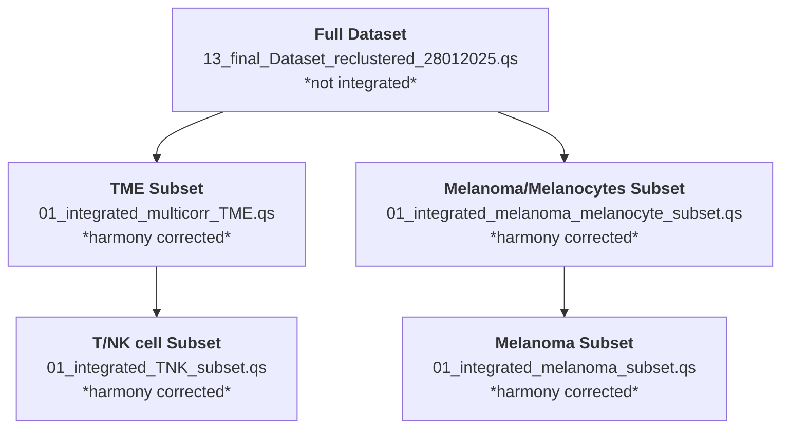

# UMscAtlas
Analysis of healthy, primary, and metastatic uveal melanoma using scRNA-seq and Xenium spatial transcriptomics. This repository includes workflows for preprocessing, integration, cell-type annotation, and characterization of malignant and TME states.

## Metadata variables documentation

| Metadata variable | Name in figure | Explanation |
| --- | --- | --- |
| primary_location  | Intraocular Location  | Location within the eye where the primary tumor arose. NA for samples that are not primary UM |
| origin | Disease Progression | Indicates if cells come from a healthy sample, primary tumor or metastasis |
| orig.ident | Sample | Identifies physical tissue sample cells originate from |
| location | Location | Location (intraocular location and location of metastasis) for all samples in the data set |
| samplename | Sample Name | Identifies biological replicates sequenced in different libraries (use instead of Sample column (that shows projectnumber and Index from FGCZ |
| healthy_location | Intraocular Location Healthy | Identifies intraocular location from healthy tissue |
| Condition | Batch | Indicates sequencing batch for each sample |
| primary_mutation | Primary Mutation | Identifies primary mutation (GNAQ, GNA11, PLCB4 or CYSLTR2) for each sample (assessed by WES or targeted sequencing) |
| secondary_mutation | Secondary Mutation | Identifies secondary mutation (BAP1, SF3B1 or EIF1AX) for each sample (assessed by WES or targeted sequencing) |
| Patient_nr | Patient Number | assigns a patient number (P1-P36) to each sequenced sample and shows which patients have multiple samples sequenced |
| organ | Organ | Identifies organ from which sample is originating |
| Gender | Gender | Identifies gender of patient sample was derived from |
| TreatmentStage_ofProcessedSample | Treatment | Indicates last treatment of patient before sampling of the sequenced sample |
| Stage_atDiagnosis | Stage at Diagnosis | Disease stage at first diagnosis |
| Mets_atDiagnosis | Metastasis at Diagnosis | Identifies if metastasis was present at disease prognosis |
| Age_atDiagnosisY | Age at Diagnosis | Identifies age at diagnosis of tumor in years |
| RiskCategory | Risk Category | Identifies risk category assigned by collaborators in Australia for primary tumors |
| Time_sinceDiagnosis | Time since Diagnosis | Shows calculated time since diagnosis in years until October 2025 |
| PrimaryTreatment | Primary Treatment | Identifies treatment of primary tumor |
| LocalProgressionPrimary | Local Progression Primary Tumor | Indicates wheter primary tumor showed disease progression or not |
| LocalProgressionTreatment | Treatment of Local Progression | Identifies which treatment was used if didease was locally progressive |
| DevelopmentOfMetastasis | Metastasis Development | Indicates whether disease developed into metastatic disease from primary tumor |
| Time_Primary-Met.Y | Time to Metastasis | Indicates time in years from primary tumor to metastasis development |
| MetastaticSite | Metastatic Site | Identifies site of metastasis development |
| MetastasisTreatment | Treatment Metastasis | Treatment of metastatic tumor |
| Time_sinceMetastasisDiagnosisY | Time since Diagnosis of Metastasis | Identifies time since diagnosis of metastasis in years until october 2025 |
| PatientStatus | Status Patient | Indicates whether patient is deceased or alive |
| LocationPrimaryTumor | Location of Primary Tumor | Identifies intaocular location of primary tumor also for metastases samples |

## Symbols to Use in Plots for h-p-m
- **healthy**: ● Circle (nr. 1)
- **primary**: ▲ Triangle (nr. 2)
- **metastases**: ◆ Diamond (nr. 5)

## Symbols to Use in Plots for primary mutation
- **GNAQ**: ● Circle (nr. 1)
- **GNA11**: ▲ Triangle (nr. 2)
- **PLCB4**: ◆ Diamond (nr. 5)
- **none**: ▼ Triangle, point down (nr. 6)
- **unknown**: ✵ Star (nr. 8)

## Available Datasets

- **Full Dataset**: All cells across all samples.
- **TME Subset**: Tumor microenvironment cells, subsetted from Full Dataset (all cells except Melanocytes and Melanoma cells).
- **Melanoma/Melanocytes Subset**: Melanoma cells and melanocytes from healthy - primary - metastases subsetted from Full Dataset.
- **Melanoma Subset**: Subset of melanoma cells from p-m UM samples subsetted from Full Dataset.

> **Notes:**
> - Melanoma cells were defined using inferred copy number variation (iCNV) profiles to distinguish malignant cells from non-malignant Melanocytes populations.
> - All subsets are **Harmony-corrected**, except the **Full Dataset**.

## Input datasets used for each sample

Which FGCZ gStore dataset each library's **counts** came from. Established by matching every cell's `nCount_RNA` per barcode against every candidate FGCZ run, so this is the measured parent of the merged object, not the most recent run of that order. Links are LDAP-protected (B-Fabric login).

Paths are kept in full and per batch on purpose. Each batch went through a different cell-QC and ambient-removal history, and collapsing them into one path would erase exactly that.

### Batches and cohorts

One batch = one B-Fabric sequencing order.

| batch | order | sequenced | cohort | libraries in atlas | composition |
|---|---|---|---|---|---|
| Batch01 | `o28554` (reprocessed as `o39760`, project `p28409`) | 2022-06 | **1** | 2 | 2 metastasis |
| Batch02 | `o34170` | 2024-02 | **1** | 6 | 6 primary |
| Batch03 | `o37319` | 2025-01 | **1** | 11 | 11 primary |
| Batch04 | `o39575` | 2025-09 | **1** | 32 | 15 metastasis, 9 primary, 8 non-malignant |
| Batch05 | `o41361` | 2026-03 | **2** | 12 | 8 non-malignant, 4 primary |

- **Cohort 1** = Batch01-04, the 51 libraries behind the published atlas paper.
- **Cohort 2** = Batch05, the 12 libraries added in 2026.

Cohort 2 is often described as "the cohort with the healthy samples", which is only partly right: **Batch04 already contributed 8 non-malignant libraries** (hCh18, hIr19, hCh20-hCh25). What is true is that cohort 2 is the first cohort that is *mostly* non-malignant - 8 of its 12 libraries - and it adds the ciliary-body sites (`hCB`) that cohort 1 does not have.

### Per batch: the full gStore path chain

| batch | cohort | order | libraries | ScSeurat dataset the atlas was built from | ambient removal (CellBender) | CellRanger | CellRanger version |
|---|---|---|---|---|---|---|---|
| Batch01 | 1 | o39760 | 2 | [`o39760_ScSeurat_2025-09-24--17-07-22`](https://fgcz-gstore.uzh.ch/projects/p28409/o39760_ScSeurat_2025-09-24--17-07-22/) | [`o39760_CellBender_2025-09-24--14-14-44`](https://fgcz-gstore.uzh.ch/projects/p28409/o39760_CellBender_2025-09-24--14-14-44/) | [`o39760_CellRangerMulti_2025-09-24--11-17-47`](https://fgcz-gstore.uzh.ch/projects/p28409/o39760_CellRangerMulti_2025-09-24--11-17-47/) | 9.0.0 |
| Batch02 | 1 | o34170 | 2 | [`o34170_ScSeurat_2025-09-20--10-16-53`](https://fgcz-gstore.uzh.ch/projects/p31662/o34170_ScSeurat_2025-09-20--10-16-53/) | [`o34170_CellBender_2025-09-19--17-11-51`](https://fgcz-gstore.uzh.ch/projects/p31662/o34170_CellBender_2025-09-19--17-11-51/) | [`o34170_CellRangerCount_2025-09-19--14-32-55`](https://fgcz-gstore.uzh.ch/projects/p31662/o34170_CellRangerCount_2025-09-19--14-32-55/) | 9.0.0 |
| Batch02 | 1 | o34170 | 4 | [`o34170_ScSeurat_2025-09-21--15-55-39`](https://fgcz-gstore.uzh.ch/projects/p31662/o34170_ScSeurat_2025-09-21--15-55-39/) | [`o34170_CellBender_2025-09-20--20-49-40`](https://fgcz-gstore.uzh.ch/projects/p31662/o34170_CellBender_2025-09-20--20-49-40/) | [`o34170_CellRangerMulti_2025-09-19--18-19-58`](https://fgcz-gstore.uzh.ch/projects/p31662/o34170_CellRangerMulti_2025-09-19--18-19-58/) | 9.0.0 |
| Batch03 | 1 | o37319 | 11 | [`o37319_ScSeurat_2025-01-22--11-24-05`](https://fgcz-gstore.uzh.ch/projects/p31662/o37319_ScSeurat_2025-01-22--11-24-05/) | - | [`o37319_CellRangerCount_2025-01-14--10-38-08`](https://fgcz-gstore.uzh.ch/projects/p31662/o37319_CellRangerCount_2025-01-14--10-38-08/) | 9.0.0 |
| Batch04 | 1 | o39575 | 6 | [`o39575_ScSeurat_2025-09-23--17-36-32`](https://fgcz-gstore.uzh.ch/projects/p31662/o39575_ScSeurat_2025-09-23--17-36-32/) | [`o39575_CellBender_2025-09-19--18-08-01`](https://fgcz-gstore.uzh.ch/projects/p31662/o39575_CellBender_2025-09-19--18-08-01/) | [`o39575_CellRangerCount_2025-09-16--09-43-07`](https://fgcz-gstore.uzh.ch/projects/p31662/o39575_CellRangerCount_2025-09-16--09-43-07/) | 9.0.0 |
| Batch04 | 1 | o39575 | 26 | [`o39575_ScSeurat_2025-09-22--18-32-30`](https://fgcz-gstore.uzh.ch/projects/p31662/o39575_ScSeurat_2025-09-22--18-32-30/) | [`o39575_CellBender_2025-09-19--18-08-01`](https://fgcz-gstore.uzh.ch/projects/p31662/o39575_CellBender_2025-09-19--18-08-01/) | [`o39575_CellRangerCount_2025-09-16--09-43-07`](https://fgcz-gstore.uzh.ch/projects/p31662/o39575_CellRangerCount_2025-09-16--09-43-07/) | 9.0.0 |
| Batch05 | 2 | o41361 | 8 | [`o41361_ScSeurat_2026-04-28--16-11-43`](https://fgcz-gstore.uzh.ch/projects/p31662/o41361_ScSeurat_2026-04-28--16-11-43/) | [`o41361_CellBender_2026-04-28--10-23-46`](https://fgcz-gstore.uzh.ch/projects/p31662/o41361_CellBender_2026-04-28--10-23-46/) | [`o41361_CellRangerCount_2026-03-28--07-10-14`](https://fgcz-gstore.uzh.ch/projects/p31662/o41361_CellRangerCount_2026-03-28--07-10-14/) | 8.0.1 |

**Batch03 is the only batch whose counts did not pass through CellBender.** Ambient RNA is mitochondria-enriched, so its cells carry a higher mitochondrial fraction than the other four batches for a purely technical reason.

Four Batch05 libraries are **not** in the table above: `pUM26`, `pUM27`, `pUM29` and `pUM32` (24,190 cells). Their barcodes overlap the like-named o41361 library at chance level and their counts match neither the CellRanger nor the CellBender matrix, filtered or raw, so those four were processed outside FGCZ and their input dataset is unknown.

### Per library

| batch | cohort | library (`Sample`) | `samplename` | patient | cells in atlas | input dataset |
|---|---|---|---|---|---|---|
| Batch01 | 1 | `o28554_1_13-FNA_liv_bl_GEX_F9` | mUM13_2 | mUM13 | 9,336 | [`o39760_ScSeurat_2025-09-24--17-07-22`](https://fgcz-gstore.uzh.ch/projects/p28409/o39760_ScSeurat_2025-09-24--17-07-22/o28554_1_13-FNA_liv_bl_GEX_F9_SCReport/) |
| Batch01 | 1 | `o28554_1_14-CNA_liv_bl_GEX_F10` | mUM13_1 | mUM13 | 2,770 | [`o39760_ScSeurat_2025-09-24--17-07-22`](https://fgcz-gstore.uzh.ch/projects/p28409/o39760_ScSeurat_2025-09-24--17-07-22/o28554_1_14-CNA_liv_bl_GEX_F10_SCReport/) |
| Batch02 | 1 | `341701_01-pUM1_637_GEX_H6` | pUM01 | pUM01 | 305 | [`o34170_ScSeurat_2025-09-20--10-16-53`](https://fgcz-gstore.uzh.ch/projects/p31662/o34170_ScSeurat_2025-09-20--10-16-53/341701_01-pUM1_637_GEX_H6_SCReport/) |
| Batch02 | 1 | `341701_02-pUM2_801_GEX_H7` | pUM02 | pUM02 | 5,166 | [`o34170_ScSeurat_2025-09-20--10-16-53`](https://fgcz-gstore.uzh.ch/projects/p31662/o34170_ScSeurat_2025-09-20--10-16-53/341701_02-pUM2_801_GEX_H7_SCReport/) |
| Batch02 | 1 | `341701_03-pUM3_669_GEX_H8` | pUM03 | pUM03 | 5,408 | [`o34170_ScSeurat_2025-09-21--15-55-39`](https://fgcz-gstore.uzh.ch/projects/p31662/o34170_ScSeurat_2025-09-21--15-55-39/341701_03-pUM3_669_GEX_H8_SCReport/) |
| Batch02 | 1 | `341701_04-pUM4_696_GEX_H12` | pUM04 | pUM04 | 9,868 | [`o34170_ScSeurat_2025-09-21--15-55-39`](https://fgcz-gstore.uzh.ch/projects/p31662/o34170_ScSeurat_2025-09-21--15-55-39/341701_04-pUM4_696_GEX_H12_SCReport/) |
| Batch02 | 1 | `341701_05-pUM5_713_GEX_A3` | pUM05 | pUM05 | 8,105 | [`o34170_ScSeurat_2025-09-21--15-55-39`](https://fgcz-gstore.uzh.ch/projects/p31662/o34170_ScSeurat_2025-09-21--15-55-39/341701_05-pUM5_713_GEX_A3_SCReport/) |
| Batch02 | 1 | `341701_06-pUM6_717_GEX_A4` | pUM06 | pUM06 | 3,733 | [`o34170_ScSeurat_2025-09-21--15-55-39`](https://fgcz-gstore.uzh.ch/projects/p31662/o34170_ScSeurat_2025-09-21--15-55-39/341701_06-pUM6_717_GEX_A4_SCReport/) * |
| Batch03 | 1 | `373191_02-pUM9_GEX_F12` | pUM09_1 | pUM09 | 8,454 | [`o37319_ScSeurat_2025-01-22--11-24-05`](https://fgcz-gstore.uzh.ch/projects/p31662/o37319_ScSeurat_2025-01-22--11-24-05/373191_02-pUM9_GEX_F12_SCReport/) |
| Batch03 | 1 | `373191_03-pUM9_16S_GEX_G1` | pUM09_2 | pUM09 | 6,642 | [`o37319_ScSeurat_2025-01-22--11-24-05`](https://fgcz-gstore.uzh.ch/projects/p31662/o37319_ScSeurat_2025-01-22--11-24-05/373191_03-pUM9_16S_GEX_G1_SCReport/) |
| Batch03 | 1 | `373191_05-pUM11_GEX_G3` | pUM11_1 | pUM11 | 3,711 | [`o37319_ScSeurat_2025-01-22--11-24-05`](https://fgcz-gstore.uzh.ch/projects/p31662/o37319_ScSeurat_2025-01-22--11-24-05/373191_05-pUM11_GEX_G3_SCReport/) |
| Batch03 | 1 | `373191_06-pUM11_16S_GEX_G4` | pUM11_2 | pUM11 | 5,728 | [`o37319_ScSeurat_2025-01-22--11-24-05`](https://fgcz-gstore.uzh.ch/projects/p31662/o37319_ScSeurat_2025-01-22--11-24-05/373191_06-pUM11_16S_GEX_G4_SCReport/) |
| Batch03 | 1 | `373191_07-pUM12_GEX_G5` | pUM12_1 | pUM12 | 286 | [`o37319_ScSeurat_2025-01-22--11-24-05`](https://fgcz-gstore.uzh.ch/projects/p31662/o37319_ScSeurat_2025-01-22--11-24-05/373191_07-pUM12_GEX_G5_SCReport/) |
| Batch03 | 1 | `373191_08-pUM12_16S_GEX_G6` | pUM12_2 | pUM12 | 401 | [`o37319_ScSeurat_2025-01-22--11-24-05`](https://fgcz-gstore.uzh.ch/projects/p31662/o37319_ScSeurat_2025-01-22--11-24-05/373191_08-pUM12_16S_GEX_G6_SCReport/) |
| Batch03 | 1 | `373191_09-pUM14_GEX_G7` | pUM14 | pUM14 | 694 | [`o37319_ScSeurat_2025-01-22--11-24-05`](https://fgcz-gstore.uzh.ch/projects/p31662/o37319_ScSeurat_2025-01-22--11-24-05/373191_09-pUM14_GEX_G7_SCReport/) |
| Batch03 | 1 | `373191_10-pUM15_GEX_G8` | pUM15_1 | pUM15 | 8,987 | [`o37319_ScSeurat_2025-01-22--11-24-05`](https://fgcz-gstore.uzh.ch/projects/p31662/o37319_ScSeurat_2025-01-22--11-24-05/373191_10-pUM15_GEX_G8_SCReport/) |
| Batch03 | 1 | `373191_11-pUM15_16S_GEX_G9` | pUM15_2 | pUM15 | 8,319 | [`o37319_ScSeurat_2025-01-22--11-24-05`](https://fgcz-gstore.uzh.ch/projects/p31662/o37319_ScSeurat_2025-01-22--11-24-05/373191_11-pUM15_16S_GEX_G9_SCReport/) |
| Batch03 | 1 | `373191_12-pUM17_GEX_G10` | pUM17_1 | pUM17 | 2,023 | [`o37319_ScSeurat_2025-01-22--11-24-05`](https://fgcz-gstore.uzh.ch/projects/p31662/o37319_ScSeurat_2025-01-22--11-24-05/373191_12-pUM17_GEX_G10_SCReport/) |
| Batch03 | 1 | `373191_13-pUM17_16S_GEX_G11` | pUM17_2 | pUM17 | 2,508 | [`o37319_ScSeurat_2025-01-22--11-24-05`](https://fgcz-gstore.uzh.ch/projects/p31662/o37319_ScSeurat_2025-01-22--11-24-05/373191_13-pUM17_16S_GEX_G11_SCReport/) |
| Batch04 | 1 | `395751_08-mUM01_1_GEX_E9` | mUM01_1 | mUM01 | 2,676 | [`o39575_ScSeurat_2025-09-23--17-36-32`](https://fgcz-gstore.uzh.ch/projects/p31662/o39575_ScSeurat_2025-09-23--17-36-32/395751_08-mUM01_1_GEX_E9_SCReport/) |
| Batch04 | 1 | `395751_10-mUM02_GEX_E11` | mUM02 | mUM02 | 9,209 | [`o39575_ScSeurat_2025-09-22--18-32-30`](https://fgcz-gstore.uzh.ch/projects/p31662/o39575_ScSeurat_2025-09-22--18-32-30/395751_10-mUM02_GEX_E11_SCReport/) |
| Batch04 | 1 | `395751_12-mUM04_GEX_F5` | mUM04 | mUM04 | 9,063 | [`o39575_ScSeurat_2025-09-22--18-32-30`](https://fgcz-gstore.uzh.ch/projects/p31662/o39575_ScSeurat_2025-09-22--18-32-30/395751_12-mUM04_GEX_F5_SCReport/) |
| Batch04 | 1 | `395751_13-mUM05_GEX_F6` | mUM05 | mUM05 | 11,815 | [`o39575_ScSeurat_2025-09-22--18-32-30`](https://fgcz-gstore.uzh.ch/projects/p31662/o39575_ScSeurat_2025-09-22--18-32-30/395751_13-mUM05_GEX_F6_SCReport/) |
| Batch04 | 1 | `395751_14-mUM06_GEX_F7` | mUM06 | mUM06 | 10,540 | [`o39575_ScSeurat_2025-09-22--18-32-30`](https://fgcz-gstore.uzh.ch/projects/p31662/o39575_ScSeurat_2025-09-22--18-32-30/395751_14-mUM06_GEX_F7_SCReport/) |
| Batch04 | 1 | `395751_15-mUM07_GEX_F8` | mUM07 | mUM07 | 10,966 | [`o39575_ScSeurat_2025-09-22--18-32-30`](https://fgcz-gstore.uzh.ch/projects/p31662/o39575_ScSeurat_2025-09-22--18-32-30/395751_15-mUM07_GEX_F8_SCReport/) |
| Batch04 | 1 | `395751_16-mUM08_1_GEX_F9` | mUM08_1 | mUM08 | 2,492 | [`o39575_ScSeurat_2025-09-22--18-32-30`](https://fgcz-gstore.uzh.ch/projects/p31662/o39575_ScSeurat_2025-09-22--18-32-30/395751_16-mUM08_1_GEX_F9_SCReport/) |
| Batch04 | 1 | `395751_17-mUM08_2_GEX_F10` | mUM08_2 | mUM08 | 1,998 | [`o39575_ScSeurat_2025-09-22--18-32-30`](https://fgcz-gstore.uzh.ch/projects/p31662/o39575_ScSeurat_2025-09-22--18-32-30/395751_17-mUM08_2_GEX_F10_SCReport/) |
| Batch04 | 1 | `395751_18-mUM09_GEX_F11` | mUM09 | mUM09 | 4,457 | [`o39575_ScSeurat_2025-09-23--17-36-32`](https://fgcz-gstore.uzh.ch/projects/p31662/o39575_ScSeurat_2025-09-23--17-36-32/395751_18-mUM09_GEX_F11_SCReport/) |
| Batch04 | 1 | `395751_20-mUM11_GEX_G1` | mUM11 | mUM11 | 11,640 | [`o39575_ScSeurat_2025-09-22--18-32-30`](https://fgcz-gstore.uzh.ch/projects/p31662/o39575_ScSeurat_2025-09-22--18-32-30/395751_20-mUM11_GEX_G1_SCReport/) |
| Batch04 | 1 | `395751_22-pUM10_GEX_G3` | pUM10 | pUM10 | 4,465 | [`o39575_ScSeurat_2025-09-22--18-32-30`](https://fgcz-gstore.uzh.ch/projects/p31662/o39575_ScSeurat_2025-09-22--18-32-30/395751_22-pUM10_GEX_G3_SCReport/) |
| Batch04 | 1 | `395751_24-pUM16_GEX_G5` | pUM16 | pUM16 | 5,544 | [`o39575_ScSeurat_2025-09-22--18-32-30`](https://fgcz-gstore.uzh.ch/projects/p31662/o39575_ScSeurat_2025-09-22--18-32-30/395751_24-pUM16_GEX_G5_SCReport/) |
| Batch04 | 1 | `395751_25-hCh18_GEX_G6` | hCh18 | hCh18 | 2,443 | [`o39575_ScSeurat_2025-09-22--18-32-30`](https://fgcz-gstore.uzh.ch/projects/p31662/o39575_ScSeurat_2025-09-22--18-32-30/395751_25-hCh18_GEX_G6_SCReport/) |
| Batch04 | 1 | `395751_26-pUM19_GEX_G7` | pUM19 | pUM19 | 4,070 | [`o39575_ScSeurat_2025-09-22--18-32-30`](https://fgcz-gstore.uzh.ch/projects/p31662/o39575_ScSeurat_2025-09-22--18-32-30/395751_26-pUM19_GEX_G7_SCReport/) |
| Batch04 | 1 | `395751_27-hIr19_GEX_G8` | hIr19 | hIr19 | 5,340 | [`o39575_ScSeurat_2025-09-22--18-32-30`](https://fgcz-gstore.uzh.ch/projects/p31662/o39575_ScSeurat_2025-09-22--18-32-30/395751_27-hIr19_GEX_G8_SCReport/) |
| Batch04 | 1 | `395751_29-pUM20_GEX_G10` | pUM20 | pUM20 | 6,594 | [`o39575_ScSeurat_2025-09-23--17-36-32`](https://fgcz-gstore.uzh.ch/projects/p31662/o39575_ScSeurat_2025-09-23--17-36-32/395751_29-pUM20_GEX_G10_SCReport/) |
| Batch04 | 1 | `395751_30-hCh20_GEX_G11` | hCh20 | hCh20 | 5,662 | [`o39575_ScSeurat_2025-09-22--18-32-30`](https://fgcz-gstore.uzh.ch/projects/p31662/o39575_ScSeurat_2025-09-22--18-32-30/395751_30-hCh20_GEX_G11_SCReport/) |
| Batch04 | 1 | `395751_31-pUM21_GEX_G12` | pUM21 | pUM21 | 7,758 | [`o39575_ScSeurat_2025-09-22--18-32-30`](https://fgcz-gstore.uzh.ch/projects/p31662/o39575_ScSeurat_2025-09-22--18-32-30/395751_31-pUM21_GEX_G12_SCReport/) |
| Batch04 | 1 | `395751_32-hCh21_GEX_H1` | hCh21 | hCh21 | 5,440 | [`o39575_ScSeurat_2025-09-22--18-32-30`](https://fgcz-gstore.uzh.ch/projects/p31662/o39575_ScSeurat_2025-09-22--18-32-30/395751_32-hCh21_GEX_H1_SCReport/) |
| Batch04 | 1 | `395751_33-pUM22_GEX_H2` | pUM22 | pUM22 | 3,711 | [`o39575_ScSeurat_2025-09-22--18-32-30`](https://fgcz-gstore.uzh.ch/projects/p31662/o39575_ScSeurat_2025-09-22--18-32-30/395751_33-pUM22_GEX_H2_SCReport/) |
| Batch04 | 1 | `395751_34-hCh22_GEX_H3` | hCh22 | hCh22 | 1,515 | [`o39575_ScSeurat_2025-09-22--18-32-30`](https://fgcz-gstore.uzh.ch/projects/p31662/o39575_ScSeurat_2025-09-22--18-32-30/395751_34-hCh22_GEX_H3_SCReport/) |
| Batch04 | 1 | `395751_35-pUM23_GEX_H4` | pUM23 | pUM23 | 16,256 | [`o39575_ScSeurat_2025-09-23--17-36-32`](https://fgcz-gstore.uzh.ch/projects/p31662/o39575_ScSeurat_2025-09-23--17-36-32/395751_35-pUM23_GEX_H4_SCReport/) |
| Batch04 | 1 | `395751_36-hCh23_GEX_H5` | hCh23 | hCh23 | 858 | [`o39575_ScSeurat_2025-09-22--18-32-30`](https://fgcz-gstore.uzh.ch/projects/p31662/o39575_ScSeurat_2025-09-22--18-32-30/395751_36-hCh23_GEX_H5_SCReport/) |
| Batch04 | 1 | `395751_37-pUM24_GEX_H6` | pUM24 | pUM24 | 8,645 | [`o39575_ScSeurat_2025-09-22--18-32-30`](https://fgcz-gstore.uzh.ch/projects/p31662/o39575_ScSeurat_2025-09-22--18-32-30/395751_37-pUM24_GEX_H6_SCReport/) |
| Batch04 | 1 | `395751_38-hCh24_GEX_H7` | hCh24 | hCh24 | 428 | [`o39575_ScSeurat_2025-09-23--17-36-32`](https://fgcz-gstore.uzh.ch/projects/p31662/o39575_ScSeurat_2025-09-23--17-36-32/395751_38-hCh24_GEX_H7_SCReport/) |
| Batch04 | 1 | `395751_39-pUM25_GEX_H8` | pUM25 | pUM25 | 10,609 | [`o39575_ScSeurat_2025-09-23--17-36-32`](https://fgcz-gstore.uzh.ch/projects/p31662/o39575_ScSeurat_2025-09-23--17-36-32/395751_39-pUM25_GEX_H8_SCReport/) |
| Batch04 | 1 | `395751_40-hCh25_GEX_H9` | hCh25 | hCh25 | 3,406 | [`o39575_ScSeurat_2025-09-22--18-32-30`](https://fgcz-gstore.uzh.ch/projects/p31662/o39575_ScSeurat_2025-09-22--18-32-30/395751_40-hCh25_GEX_H9_SCReport/) |
| Batch04 | 1 | `395751_48-mUM14_BL_GEX_E1` | mUM14 | mUM14 | 4,867 | [`o39575_ScSeurat_2025-09-22--18-32-30`](https://fgcz-gstore.uzh.ch/projects/p31662/o39575_ScSeurat_2025-09-22--18-32-30/395751_48-mUM14_BL_GEX_E1_SCReport/) |
| Batch04 | 1 | `395751_51-mUM16_BL_GEX_E4` | mUM16 | mUM16 | 6,400 | [`o39575_ScSeurat_2025-09-22--18-32-30`](https://fgcz-gstore.uzh.ch/projects/p31662/o39575_ScSeurat_2025-09-22--18-32-30/395751_51-mUM16_BL_GEX_E4_SCReport/) |
| Batch04 | 1 | `395751_53-mUM18_GEX_E6` | mUM18 | mUM18 | 4,160 | [`o39575_ScSeurat_2025-09-22--18-32-30`](https://fgcz-gstore.uzh.ch/projects/p31662/o39575_ScSeurat_2025-09-22--18-32-30/395751_53-mUM18_GEX_E6_SCReport/) |
| Batch04 | 1 | `395751_54-mUM19_GEX_E7` | mUM19 | mUM19 | 4,913 | [`o39575_ScSeurat_2025-09-22--18-32-30`](https://fgcz-gstore.uzh.ch/projects/p31662/o39575_ScSeurat_2025-09-22--18-32-30/395751_54-mUM19_GEX_E7_SCReport/) |
| Batch04 | 1 | `395751_55-mUM20_GEX_E8` | mUM20 | mUM20 | 6,105 | [`o39575_ScSeurat_2025-09-22--18-32-30`](https://fgcz-gstore.uzh.ch/projects/p31662/o39575_ScSeurat_2025-09-22--18-32-30/395751_55-mUM20_GEX_E8_SCReport/) |
| Batch05 | 2 | `hCB54` | hCB54 | hCB54 | 2,548 | [`o41361_ScSeurat_2026-04-28--16-11-43`](https://fgcz-gstore.uzh.ch/projects/p31662/o41361_ScSeurat_2026-04-28--16-11-43/hCB54_SCReport/) |
| Batch05 | 2 | `hCB55` | hCB55 | hCB55 | 6,295 | [`o41361_ScSeurat_2026-04-28--16-11-43`](https://fgcz-gstore.uzh.ch/projects/p31662/o41361_ScSeurat_2026-04-28--16-11-43/hCB55_SCReport/) |
| Batch05 | 2 | `hCB56` | hCB56 | hCB56 | 380 | [`o41361_ScSeurat_2026-04-28--16-11-43`](https://fgcz-gstore.uzh.ch/projects/p31662/o41361_ScSeurat_2026-04-28--16-11-43/hCB56_SCReport/) |
| Batch05 | 2 | `hCh28` | hCh28 | hCh28 | 801 | [`o41361_ScSeurat_2026-04-28--16-11-43`](https://fgcz-gstore.uzh.ch/projects/p31662/o41361_ScSeurat_2026-04-28--16-11-43/hCh28_SCReport/) |
| Batch05 | 2 | `hCh29` | hCh29 | hCh29 | 8,654 | [`o41361_ScSeurat_2026-04-28--16-11-43`](https://fgcz-gstore.uzh.ch/projects/p31662/o41361_ScSeurat_2026-04-28--16-11-43/hCh29_SCReport/) |
| Batch05 | 2 | `hIr51` | hIr51 | hIr51 | 1,791 | [`o41361_ScSeurat_2026-04-28--16-11-43`](https://fgcz-gstore.uzh.ch/projects/p31662/o41361_ScSeurat_2026-04-28--16-11-43/hIr51_SCReport/) |
| Batch05 | 2 | `hIr52` | hIr52 | hIr52 | 11,985 | [`o41361_ScSeurat_2026-04-28--16-11-43`](https://fgcz-gstore.uzh.ch/projects/p31662/o41361_ScSeurat_2026-04-28--16-11-43/hIr52_SCReport/) |
| Batch05 | 2 | `hIr53` | hIr53 | hIr53 | 7,035 | [`o41361_ScSeurat_2026-04-28--16-11-43`](https://fgcz-gstore.uzh.ch/projects/p31662/o41361_ScSeurat_2026-04-28--16-11-43/hIr53_SCReport/) |
| Batch05 | 2 | `pUM26` | pUM26 | pUM26 | 16,717 | **unknown - processed outside FGCZ** |
| Batch05 | 2 | `pUM27` | pUM27 | pUM27 | 3,260 | **unknown - processed outside FGCZ** |
| Batch05 | 2 | `pUM29` | pUM29 | pUM29 | 3,378 | **unknown - processed outside FGCZ** |
| Batch05 | 2 | `pUM32` | pUM32 | pUM32 | 835 | **unknown - processed outside FGCZ** |

\* `341701_06-pUM6_717_GEX_A4`: the counts match a CellRanger-input and a CellBender-input run equally, i.e. CellBender removed nothing measurable from this library, so its input cannot be distinguished. Listed under the CellBender run its batch-mates came from.

## Metadata Structure in Objects

Each Seurat object contains the following components:

#### 1. meta.data
Cell-level annotations and sample information:
- **`majority_celltype`**: Broad cell type annotation.
- **`SubTyping`**: Detailed immune cell subtypes.
- **`orig.ident`**: Original sample identifier (use for all analyses except GloScope).
- **`samplename`**: Library identifier.

> **Tip:** Refer to the summary table at the top and the provided R script for recommended naming conventions and color palettes.

---

#### 2. reductions
Dimensionality reduction results for visualization and integration:
- **`umap`**: UMAP coordinates for clustering and visualization.
- **`pca`**: PCA embeddings for exploratory analysis.
- **Integration**: All subsets are Harmony-corrected (except the Full Dataset).
-   use reduction: **`umap`** for **Full Dataset**
-   use reduction: **`umap_Condition_and_orig.ident_50PC_theta2`** for **Harmony-corrected Datasets**

---

#### 3. assays
Gene expression data:
- **`RNA`**: Normalized gene expression matrix (default assay for most analyses).

